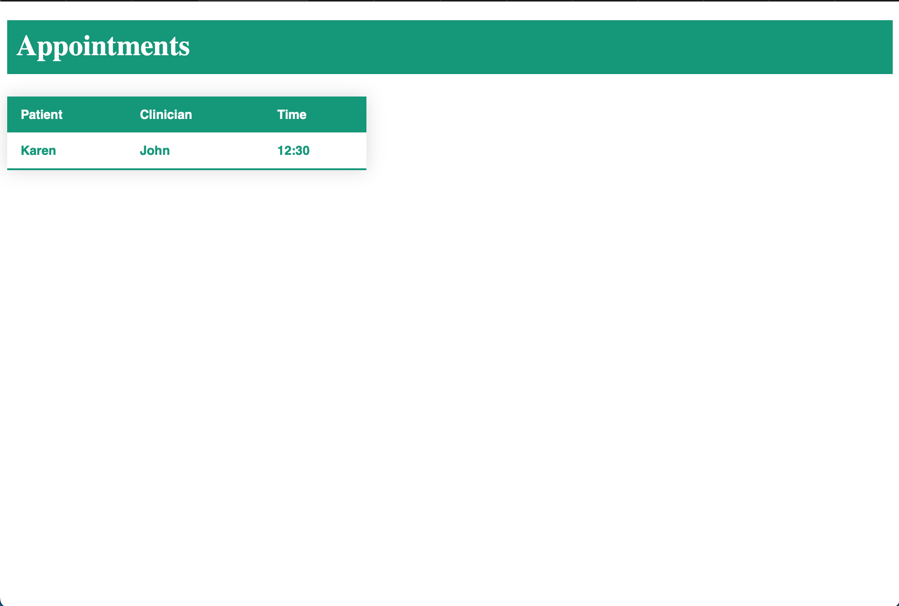

# Total Life Take Home Project
### Author: James Rota

## Objective

### Part 1
    - Design a clinician, patient, appointment table.
    - Setup Relationships
    - Implement functionality statements
    - Validate incoming requests
### Part 2
    - Display the appointment list
    - Implement time range filter
    - Style the webpage, using any styling
    - Use the database from part 1

## Table Design

    I had to learn how to use sqlite3, I followed the youtuber TM Quest as a guide for this project. Reference: https://www.youtube.com/@TMQuest.

    After learning the basic syntax, I could use my knowledge of SQL to create the tables and structure. 

    Here is the design of the tables:

    Table - clinician
    ==================
    Primary key NPI_NUM
    name Text
    trouble Text

    Table - patient
    ==================
    Primary key id
    name Text
    clincian_id int --> foreign key to the clinician table, the clinician has to exist. This means a patient cannot be created without having an existing clinician in the database. This could be an issue.  
    trouble Text --> Why the patient needs therapy (Depression, trauma, etc) - I recognize this is terribly generalized

    Table - appointment
    ===================
    Primary Key id
    patient_id --> (foreign key) appointment can't exist without valid patient 
    clinician_id --> (foreign key) appointment can't exist without valid clinician
    appointment_time TEXT --> When the appointment takes place

## index.py - the creation of the tables

   index.py is where I create the database using sqlite3, I create the tables with restraints and added sample data to the tables.

## functions.py - the functionality of the project, adding, deleting, updating, selecting from the database.

    I used python functions to make querying from the database easy to use when I eventually move on to displaying the information. Each function takes relevant parameters and does the appropriate operation using the inputed values.

    ** Note ** I couldn't figure out how to validate the information in the database, so one could add invalid information into the table. 

## routes.py

    I used Flask and a virtual environment for a quick server solution, this made communication between the database created in part 1 and the html webpage easy to implement. 

    routes.py uses get_appointments_info_patient_name, get_appointments_info_clinician_name, get_appointments_info_appointment_time from my functions.py file, to get the relevant information from the database. Then I send that information to homepage.html and display it in a table. 

    ** Note ** I couldn't figure out the time-range implementation, I don't know how this works and couldn't figure out how to sort the items in the database with this time filter. 

## homepage.html

    homepage.html uses appointment information from the database and displays it in a table. I wanted to add buttons and input fields to quickly add rows to the database, but the constraints and validation of fields was too complicated for the time frame I have to complete this test.

    Here is what the webpage looks like:

    

## Instructions

    1. Clone the repository

    2. Run index.py to create the database

    3. I have the virtual environment included, but make sure Flask is installed

    4. Activate the virtual environment - virtual_env/bin/activate

    5. Type in the terminal: "python3 run.py", local server should be running, click on server link "http://127.0.0.1:5000"

